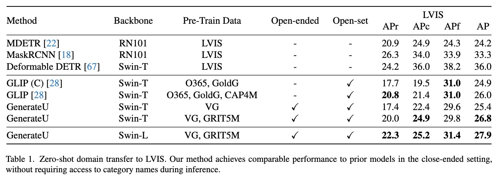
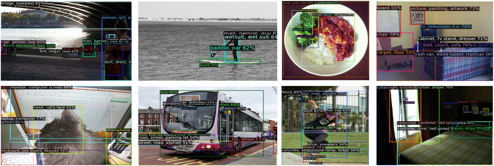
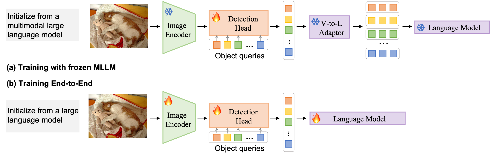

<div align="center">

<div class="logo">
   <a href="">
      
   </a>
</div>

<h1>Generative Region-Language Pretraining for Open-Ended Object Detection</h1>

<div>
    <a href='https://clin1223.github.io/' target='_blank'>Chuang Lin</a>&emsp;
    <a href='https://enjoyyi.github.io/' target='_blank'>Yi Jiang</a>&emsp;
    <a href='https://research.monash.edu/en/persons/lizhen-qu' target='_blank'>Lizhen Qu</a>&emsp;
    <a href='https://shallowyuan.github.io/' target='_blank'>Zehuan Yuan</a>&emsp;
    <a href='https://jianfei-cai.github.io/' target='_blank'>Jianfei Cai</a>
</div>
<div>
    Monash University &emsp; 
    ByteDance Inc.&emsp; 
</div>

<div>
    <strong>CVPR 2024</strong>
</div>

<div>
    <h4 align="center">
        <a href="https://arxiv.org/" target='_blank'>
        
        </a>
        <a href="https://clin1223.github.io/" target='_blank'>
        
        </a>
        
    </h4>
</div>

⭐ If GenerateU is helpful to your projects, please help star this repo. Thanks! 🤗

<!-- For more visual results, go checkout our <a href="https://shangchenzhou.com/projects/ProPainter/" target="_blank">project page</a> -->


---

</div>


<!-- ## Update
- **2023.11.09**: Integrated to :man_artist: [OpenXLab](https://openxlab.org.cn/apps). Try out online demo! [](https://openxlab.org.cn/apps/detail/ShangchenZhou/ProPainter)
- **2023.11.09**: Integrated to :hugs: [Hugging Face](https://huggingface.co/spaces). Try out online demo! [](https://huggingface.co/spaces/sczhou/ProPainter)
- **2023.09.24**: We remove the watermark removal demos officially to prevent the misuse of our work for unethical purposes.
- **2023.09.21**: Add features for memory-efficient inference. Check our [GPU memory](https://github.com/sczhou/ProPainter#-memory-efficient-inference) requirements. 🚀
- **2023.09.07**: Our code and model are publicly available. 🐳
- **2023.09.01**: This repo is created. -->


<!-- ### TODO
- [ ] Make a Colab demo.
- [x] ~~Make a interactive Gradio demo.~~
- [x] ~~Update features for memory-efficient inference.~~ -->
## Highlight
- GenerateU is accepted by **CVPR2024**.
- We introduce generative **open-ended object detection**, which is a more general and practical setting where categorical information is not explicitly defined. Such a setting is especially meaningful for scenarios where users lack precise knowledge of object cate- gories during inference.
-  Our GenerateU achieves comparable results to the open-vocabulary object detection method GLIP, even though **the category names are not seen by GenerateU during inference**. 


## Results
### Zero-shot domain transfer to LVIS



## Visualizations

#### 👨🏻‍🎨 Pseudo-label Examples 

<!-- <table>
<tr>
   <td> 
      
   </td>
   <td> 
      
   </td>
</tr>
</table> -->

#### 🎨 Zero-shot LVIS

<!-- <table>
<tr>
   <td> 
      
   </td>
   <td> 
      
   </td>
</tr>
<tr>
   <td> 
      
   </td>
   <td> 
      
   </td>
</tr>
</table> -->


## Overview



## Dependencies and Installation

1. Clone Repo

   ```bash
   git clone https://github.com/clin1223/GenerateU.git
   ```

2. Create Conda Environment and Install Dependencies

   ```bash
   # create new anaconda env
   conda create -n GenerateU python=3.8 -y
   conda activate GenerateU

   # install python dependencies
   pip3 install -e . --user
   pip3 install -r requirements.txt 

   # compile Deformable DETR
   cd projects/DDETRS/ddetrs/models/deformable_detr/ops
   bash make.sh
   ```

   - CUDA >= 11.3
   - PyTorch >= 1.10.0
   - Torchvision >= 0.11.1
   - Other required packages in `requirements.txt`

## Get Started
### Prepare pretrained models
Download our pretrained models from [here](https://huggingface.co/clin1223/GenerateU/tree/main) to the `weights` folder. For training, prepare the backbone weight Swin-Tiny and Swin-Large following instruction in [tools/convert-pretrained-swin-model-to-d2.py](tools/convert-pretrained-swin-model-to-d2.py)


The directory structure will be arranged as:
```
weights
   |- vg_swinT.pth
   |- vg_swinL.pth
   |- vg_grit5m_swinT.pth
   |- vg_grit5m_swinL.pth
   |- swin_tiny_patch4_window7_224.pkl
   |- swin_large_patch4_window12_384_22k.pkl
```

## Dataset preparation

### VG Dataset
- Download images from [VG official website](https://homes.cs.washington.edu/~ranjay/visualgenome/api.html)
- Download our pre-processed annotations: 
  [train_from_objects.json](https://huggingface.co/clin1223/GenerateU/tree/main) 

### LVIS Dataset
- Download validation images from [COCO official website](https://cocodataset.org/#download)
- Download validation annotations same as [GLIP](https://github.com/microsoft/GLIP/blob/main/DATA.md):
  [lvis_v1_minival.json](https://huggingface.co/clin1223/GenerateU/tree/main) 
- Download LVIS category [text embedding](https://huggingface.co/clin1223/GenerateU/tree/main) for mapping

### (Optional) GrIT-20M Dataset
- Download images from [GrIT-20M official website](https://github.com/microsoft/unilm/tree/master/kosmos-2#download-data)
- Run Evaluation on GrIT images to generate pseudo lables.

Dataset strcture should look like:
  ~~~
  |-- datasets
  `-- |-- vg
      |-- |-- images/
      |-- |-- train_from_objects.json
   `-- |-- lvis
      |-- |-- val2017/
      |-- |-- lvis_v1_minival.json
      |-- |-- lvis_v1_clip_a+cname_ViT-H.npy
  ~~~

## Training
By default, we train GenerateU using 16 A100 GPUs.
You can also train on a single node, but this might prevent you from reproducing the results presented in the paper.


### Single-Node Training
When pretraining with VG, single node is enough.
On a single node with 8 GPUs, run 
```
python3 launch.py --nn 1 --uni 1 \
--config-file projects/DDETRS/configs/vg_swinT.yaml OUTPUT_DIR outputs/${EXP_NAME}
```

### Multiple-Node Training
``` bash
# On node 0, run
python3 launch.py --nn 2 --port <PORT> --worker_rank 0 --master_address <MASTER_ADDRESS> \
--uni 1 --config-file /path/to/config/name.yaml  OUTPUT_DIR outputs/${EXP_NAME}
# On node 1, run
python3 launch.py --nn 2 --port <PORT> --worker_rank 1 --master_address <MASTER_ADDRESS> \
--uni 1 --config-file /path/to/config/name.yaml OUTPUT_DIR outputs/${EXP_NAME}
```

`<MASTER_ADDRESS>` should be the IP address of node 0. `<PORT>` should be the same among multiple nodes. If `<PORT>` is not specifed, programm will generate a random number as `<PORT>`.


## Evaluation

To evaluate a model with a trained/ pretrained model, run

```shell
python3 launch.py --nn 1 --eval-only --uni 1 --config-file /path/to/config/name.yaml  \
OUTPUT_DIR outputs/${EXP_NAME}  MODEL.WEIGHTS /path/to/weight.pth
```

<!-- ### 🏂 Quick test
We provide some examples in the [`inputs`](./inputs) folder. 
Run the following commands to try it out:
```shell
# The first example (object removal)
python inference_propainter.py --video inputs/object_removal/bmx-trees --mask inputs/object_removal/bmx-trees_mask 
# The second example (video completion)
python inference_propainter.py --video inputs/video_completion/running_car.mp4 --mask inputs/video_completion/mask_square.png --height 240 --width 432
```

The results will be saved in the `results` folder.
To test your own videos, please prepare the input `mp4 video` (or `split frames`) and `frame-wise mask(s)`.

If you want to specify the video resolution for processing or avoid running out of memory, you can set the video size of `--width` and `--height`:
```shell
# process a 576x320 video; set --fp16 to use fp16 (half precision) during inference.
python inference_propainter.py --video inputs/video_completion/running_car.mp4 --mask inputs/video_completion/mask_square.png --height 320 --width 576 --fp16
```
 -->

## Citation

   If you find our repo useful for your research, please consider citing our paper:

   ```bibtex
   @inproceedings{lin2024generateu,
      title={Generative Region-Language Pretraining for Open-Ended Object Detection},
      author={Chuang, Lin and Yi, Jiang and Lizhen, Qu and Zehuan, Yuan and Jianfei, Cai},
      booktitle={Proceedings of IEEE Conference on Computer Vision and Pattern Recognition (CVPR)},
      year={2024}
   }
   ```

## Contact
If you have any questions, please feel free to reach me out at `chuang.lin@monash.edu`. 

## Acknowledgement

This code is based on [UNINEXT](https://github.com/MasterBin-IIAU/UNINEXT/tree/master). Some code are brought from [FlanT5](https://huggingface.co/docs/transformers/model_doc/flan-t5). Thanks for their awesome works. 

Special thanks to [Bin Yan](https://github.com/MasterBin-IIAU) and [Junfeng Wu](https://github.com/wjf5203) for their valuable contributions.